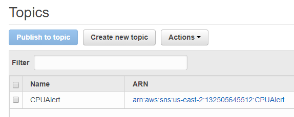
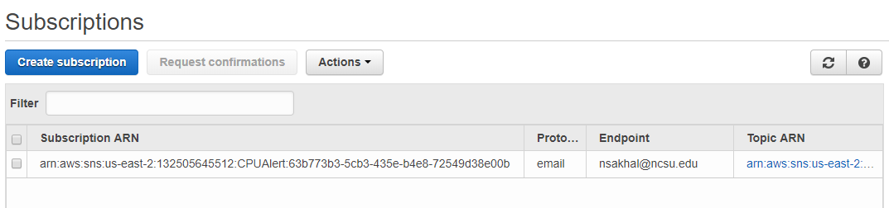
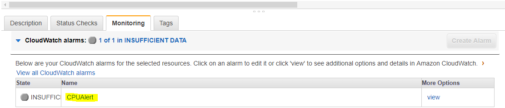
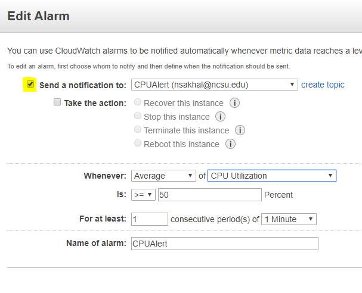
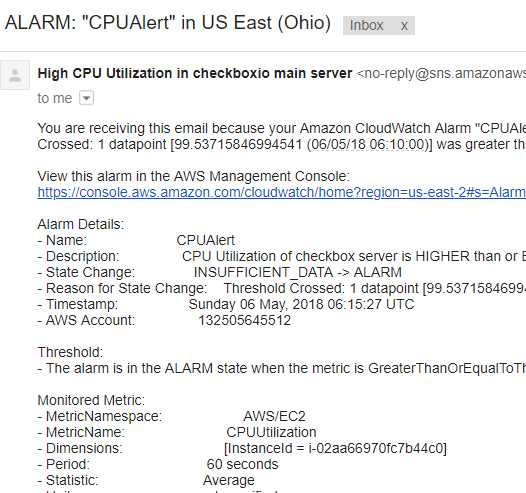

# DevOpsProjectMilestone4_p1
- The specialMilestone is performed on **checkbox.io**  
- For specialMilestone, we are performing **three** tasks on checkbox.io **main/default server:**
  - CPU Utilization Monitoring of checkbox.io server using AWS CloudWatch
  - Chaos experiment affecting CPU and RAM Memory of the checkbox server and its Resilience Management
  -  Creation of a Checkbox-bot which sends Slack Notification on `Devops` workspace when nginx service present on checkbox.io server goes up/down

### Monitoring using AWS CloudWatch and Ansible
- Monitoring is important for any application. In this case, **CPU Utilization monitoring is implemented for checkbox.io MAIN server using AWS CloudWatch services**
- Using Ansible:
  - Created Simple Notification Service(SNS) Topic named ‘CPUAlert’ on AWS
  **AWS SNS Topic Dashboard**
  
  - User(having email address as specified in the [credentials.ini](credentials.ini) file ) gets **subscribed** to the above topic **via email**  
  **AWS SNS Subscriptions Dashboard**
  
  - Automatically **create an alarm** named ‘CPUAlert’ for checkbox.io main server
  **Newly created Alarm for checkbox.io MAIN server**
  
  **AlarmDetails**
  

- Whenever **CPU utilization goes beyond 50%, alarm gets triggered** automatically and the CPU Utilization data obtained from the checkbox main server gets **published to the 'CPUAlert' topic** which was created in the above steps
- As new data got published to the 'CPUAlert' topic, **an email is sent to the subscribed user denoting HIGH CPU usage**
**Email sent by AWS SNS**

### Chaos(affecting CPU and RAM memory) experiment on checkbox.io Default Server
- Create chaos(via `chaos.sh`) by running multiple openssl commands in background in checkbox.io default server which decreases free memory present in the server and increase CPU Utilization of the server

### Resilience Management on checkbox.io default server
- Checkbox.io app deployed on two servers → Default and Backup server and Master Server is constantly checking for free memory in Default server
- Create chaos *(affects CPU and RAM memory of checkbox.io Default server)* intentionally on Default server → increases memory utilization
- Free memory < 100MB → Traffic redirected to Backup server.
- Free memory > 100MB → Traffic switch back to Default server.
- Along with migrating the traffic to Backup server, `freechaos.sh` is executed on the checkbox.io default server to resolve the chaos caused by `chaos.sh`. It basically **kills the openssl processes** created by `chaos.sh`, thereby **freeing the memory used and reducing the CPU Utilization** on the server, so that traffic can again be directed to the default server.

### Checkbox-bot for Slack Notification
+ Created *chaos by stopping nginx service* on the default/main server (running checkbox.io application) which brought down the checkbox application on the checkbox default server
+ Notify the administrator about the above created chaos by sending a notification - `Nginx service is down!!` on `#general` Slack channel using Slack integration webhook API
+ Remove the created chaos by restarting Nginx service on the default/main server which brings up the checkbox.io application on the default service
+ Notify the administrator that the problem is resolved by sending message - `Nginx service is up again!!` on `#general` Slack channel using Slack integration webhook API

### Steps
- All the steps required for this milestone are given in [steps.md](steps.md) file

### Screencast
Screencast video link - [specialMilestone-video](https://youtu.be/1CWLzDiHbNI)

### Contributions
**1. Monitoring of CPU utilization on checkbox server using AWS CloudWatch and Ansible**
- Nupur Pradeep Sakhalkar(nsakhal)

**2. Chaos experiment and Resilience Management**
+ Cherukeshi Machan(cmachan), Divyapuja Vitonde(davitond)

**3. Checkbox bot for Slack notification**  
- Neha Pradeep Sakhalkar(nsakhal2)
