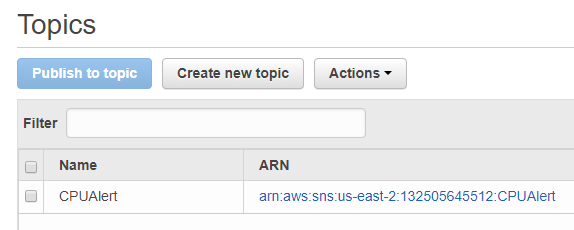
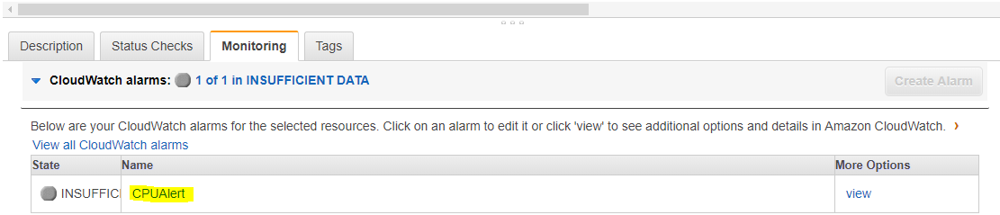

### Pre-requisites
- Steps written in the [pre-steps](pre-steps.md) file should be completed before running the below steps

### CPU Utilization Monitoring of Checkboxio MAIN/Default server using AWS CloudWatch

- Make sure that the current working directory on the Ansible VCL machine is **/home/ubuntu/DevOpsProjectMilestone4_p1**
- **ssh** into the jenkins server by using the command `ssh -i aws-m1-key.pem ubuntu@{jenkins-IP}`
- Go inside the `post_build/specialMilestone` directory and run the ansible playbook [monitor.yml](post_build/specialMilestone/monitor.yml) --> `sudo ansible-playbook -i inventory monitor.yml` .
  - This will create a _new_ topic `CPUAlert` in AWS Simple Notification Service(SNS) Topics and user with the respective emailAddress(as specified in [credentials.ini](credentials.ini) file) will be subscribed to this topic via email.  
  **AWS SNS Topic Dashboard**
  
  **AWS SNS Subscriptions Dashboard**
    

    **Note**: At this point, user will receive an email from AWS asking the user to **confirm subscription** for 'CPUAlert' topic and so the user needs to confirm it in order to receive notifications from AWS-CPUAlert Topic.  
    **Confirmation email**
    
 - Also, a **new alarm** named **"CPUAlert"** is created for the checkbox.io MAIN server. The newly created alarm for checkbox MAIN server can be seen at the bottom portion of the `Instances` section of `EC2 Dashboard` when **checkbox MAIN server instance** is selected.  
 **Newly created Alarm for checkbox.io MAIN server**
 
 - **Click** on the `CPUAlert` alarm icon and then in the `Edit Alarm` section, select the checkbox beside the `Send a notification to` and **save** it.  
 **AlarmDetails**
 

### Steps to create chaos(for CPU and RAM Memory) on checkbox.io Default server
- Check checkbox master server reflecting data from Default server on browser using {CheckboxMasterIP}:9000
- Make sure that the current working directory on the Ansible VCL machine is **/home/ubuntu/DevOpsProjectMilestone4_p1**
- **ssh** into the jenkins server by using the command `ssh -i aws-m1-key.pem ubuntu@{jenkins-IP}`
- `cd post_build`
- Go inside Default checkbox server using `ssh` command given in EC2 console or type `sudo ssh -i "aws-cb1-key.pem" ubuntu@{checkbox-default-server-IP address}` inside the `post_build` directory of Jenkins server
- Run chaos.sh using `sudo bash chaos.sh`
- You can check the effect on web browser as traffic is shifted to Backup server indicating "Page for Developers"
- Also, you can check the actual free memory and selected server as output on master checkbox server
- To check the above step, ssh to master checkbox server using example link in connect tab from EC2 console.
- Run freemem.sh using `sudo bash freemem.sh`
- Again check the effect on web browser as traffic is shifted to Default server.

### Checkbox-bot for Slack Notification
+ Create chaos by stopping nginx service on the default/main server (running checkbox.io application)
+ Notify `Nginx service is down!!` on `#general` Slack channel using Slack integration webhook API
+ Remove the created chaos by restarting Nginx service on the default/main server
+ Notify `Nginx service is up again!!` on `#general` Slack channel using Slack integration webhook API
+ Replace `<Slack API token>` with the slack token in the `credentials.ini` [file](./credentials.ini)
+ To obtain the Slack token, go to [Slack](https://devopsspecial.slack.com/services/BAK02AP3L), scroll to the `Webhook URL` section and the part written after `services/` in the url is the slack token
+ The ansible playbook required to execute checkbox-bot should be run on Jenkins server
+ To ssh into the Jenkins server using the following command (executed inside the `DevOpsProjectMilestone4_p1` directory):
```
ssh -i aws-m1-key.pem ubuntu@<Jenkins_IP>
```
+ Jenkins_IP can be obtained from [inventory](./inventory)
+ To test, run the following commands on Jenkins server CLI:
```
cd post_build/specialMilestone
sudo ansible-playbook -i inventory main.yml
```
+ The playbook consists of 2 roles: StopNginx and StartNginx
+ StopNginx role is used to create chaos
+ StartNginx is used to kill chaos
+ A single playbook is used to create chaos and repair the chaos too
+ After creating chaos, the ansible playbook takes a 2 minute pause. During the pause, one can go to local web browser and type default's server IP (obtained from inventory present in the same directory as the playbook or from AWS Web GUI) and verify that checkbox.io webpage does not load. Also, verify that in the `#general` channel of Slack, a notification `Nginx service is down!!`pops up
+ After the pause is over, one can verify that the checkbox.io webpage now loads. Also, in the `#general` channel of Slack, a notification `Nginx service is up again!!`pops up
